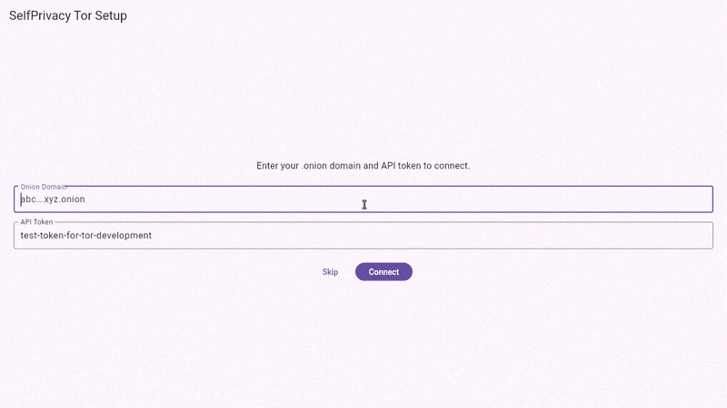
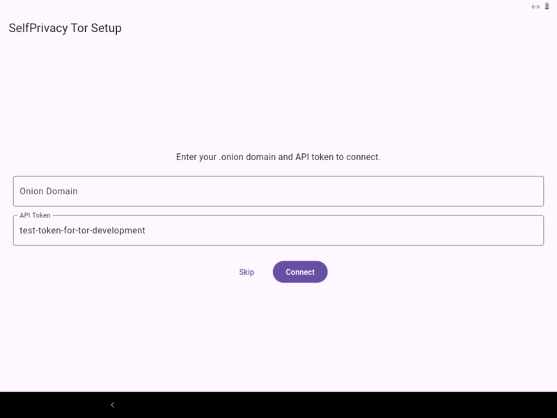
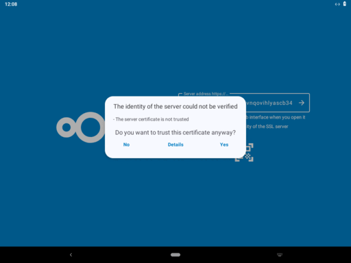

# SelfPrivacy over Tor

Run SelfPrivacy services (Nextcloud, Gitea, Jitsi, Prometheus) as Tor hidden services on a local VirtualBox VM. Everything is managed through a single script: `backend/build-and-run.sh`.

## A. Setup Backend

```bash
sudo apt install virtualbox sshpass tor
git clone --recursive https://github.com/selfprivacy-over-tor/Manager-Ubuntu-SelfPrivacy-Over-Tor.git
cd Manager-Ubuntu-SelfPrivacy-Over-Tor/backend
./build-and-run.sh
```

Downloads (or builds) the NixOS image, creates a VM, starts Tor, prints all credentials. Re-running on an existing VM gives options to restart, regenerate `.onion`, or reinstall.

```bash
./build-and-run.sh --info    # Reprint credentials anytime
```

Download prebuilt image (~2 min):


Build from source (~30 min):


## B. Ubuntu Host

### B.0 SelfPrivacy App (Linux Desktop)

```bash
./build-and-run.sh --app-linux
```

Builds the Flutter app and launches it on the Linux desktop, auto-connecting to the backend over Tor.



### B.1 Services (Nextcloud, Gitea, etc.)

```bash
./build-and-run.sh --trust-cert
```

Installs the VM's self-signed CA cert into the Ubuntu trust store. After that, open services in a Tor-enabled browser (e.g. `https://YOUR_ONION.onion/nextcloud/`).

## C. Android

### C.0 SelfPrivacy App

```bash
./build-and-run.sh --app-android
```

Builds the APK and deploys it to a connected Android device via ADB. Requires [Orbot](https://guardianproject.info/apps/org.torproject.android/) for Tor on the device.



### C.1 Services (Nextcloud, etc.)

```bash
./build-and-run.sh --trust-cert-android
```

Pushes the VM's CA cert to the Android device. Install it via Settings > Security > Install a certificate, then connect the Nextcloud app to `https://YOUR_ONION.onion/nextcloud/`.



## Architecture

```
┌─────────────────────────────────────────────────────────────┐
│                      HOST MACHINE                           │
│                                                             │
│  ┌──────────────────┐     ┌─────────────────────────────┐  │
│  │   Flutter App    │     │      Tor SOCKS Proxy        │  │
│  │  (Linux/Android) │────>│      (port 9050)            │  │
│  └──────────────────┘     └──────────────┬──────────────┘  │
│                                          │                  │
└──────────────────────────────────────────│──────────────────┘
                                           │
                              Tor Network (encrypted)
                                           │
┌──────────────────────────────────────────│──────────────────┐
│                    VIRTUALBOX VM         │                   │
│                                         v                   │
│  ┌──────────────────┐     ┌─────────────────────────────┐  │
│  │  SelfPrivacy API │<────│     Tor Hidden Service      │  │
│  │   (port 5050)    │     │  (.onion:443 -> Nginx:443)  │  │
│  └────────┬─────────┘     └─────────────────────────────┘  │
│           │                                                 │
│  ┌────────v─────────┐     ┌─────────────────────────────┐  │
│  │      Redis       │     │      Nginx (TLS)            │  │
│  │  (token storage) │     │  /api/ /nextcloud/ /git/    │  │
│  └──────────────────┘     └─────────────────────────────┘  │
│                                                             │
│                      NixOS System                           │
└─────────────────────────────────────────────────────────────┘
```

## All Commands

```
./build-and-run.sh                  # Setup backend VM (interactive)
./build-and-run.sh --info           # Print credentials
./build-and-run.sh --app-linux      # Build & run app on Linux
./build-and-run.sh --app-android    # Build & deploy app to Android
./build-and-run.sh --trust-cert     # Trust VM cert on Ubuntu
./build-and-run.sh --trust-cert-android  # Push VM cert to Android
./build-and-run.sh --help           # Show help
```

Non-interactive backend setup (for CI):

```bash
SP_BUILD_MODE=download SP_VM_ACTION=reinstall ./build-and-run.sh
SP_BUILD_MODE=build SP_VM_ACTION=reinstall ./build-and-run.sh
SP_BUILD_MODE=build SP_TOR_KEY=/path/to/key ./build-and-run.sh
```

## Troubleshooting

```bash
VBoxManage list runningvms                                              # VM not running?
sshpass -p '' ssh -p 2222 root@localhost systemctl status tor           # Tor not started?
sshpass -p '' ssh -p 2222 root@localhost curl http://127.0.0.1:5050/api/version  # API down?
curl --socks5-hostname 127.0.0.1:9050 -k https://ONION.onion/api/version        # Test from host
sshpass -p '' ssh -p 2222 root@localhost journalctl -u selfprivacy-api -f        # API logs
sshpass -p '' ssh -p 2222 root@localhost journalctl -u nginx -f                  # Nginx logs
```

## Recording Demo GIFs

All GIFs are recorded in a single session so they share the same `.onion` domain:

```bash
bash scripts/record-all-gifs.sh
```

After recording, Tor keys are automatically destroyed (the `.onion` in the GIFs is dead).

## Security

A pre-commit hook blocks committing files that contain a live `.onion` domain. Install it once:

```bash
bash scripts/install-hooks.sh
```

Before pushing, `scripts/scrub-and-push.sh` verifies no Tor key material is in the tree and destroys keys on the VM.
