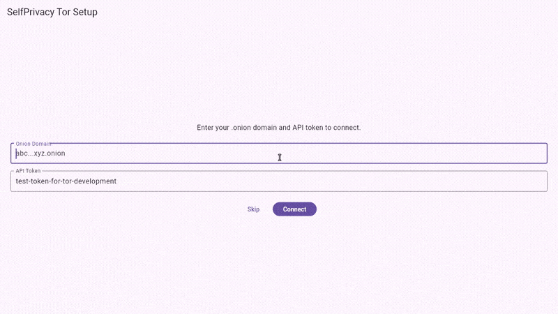
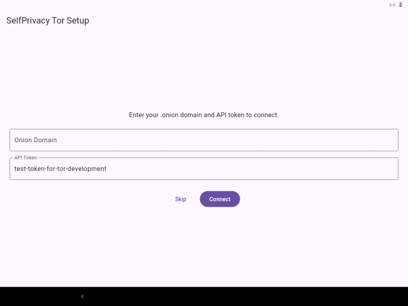
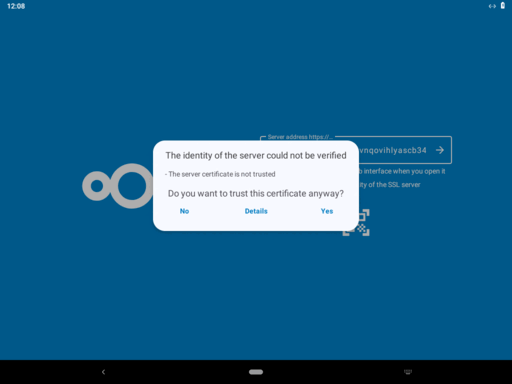

# SelfPrivacy over Tor

Run SelfPrivacy services (Nextcloud, Forgejo/Gitea, Matrix, Jitsi, Prometheus) as **Tor hidden
services**, and reach them from the SelfPrivacy app or a browser over Tor — no public IP, no domain,
no port-forwarding required.

There are two ways to run the backend and three ways to connect a client. Find your setup in the
table below and follow the sections it points to.

## Which setup are you doing?

The **backend** runs either on **Ubuntu inside a VirtualBox VM** (fully scripted) or **directly on
NixOS** (advanced, you import a NixOS module). The **client** is the SelfPrivacy Linux app, the
Android app, or just a browser.

Because the backend is a Tor **`.onion`** service, *where* the client runs is almost irrelevant — it
reaches the same `.onion` whether it sits on the same machine or a different one, across the world.
"Same device" only buys you two conveniences (auto-fetching credentials, and browsing via a
localhost proxy). So the many combinations collapse to a few instruction sets:

| Your scenario | Backend | Client | Follow |
|---|---|---|---|
| **S.A.0** — Ubuntu all-in-one | Ubuntu + VirtualBox | Linux app, **same** PC | [§1A](#1a-backend-on-ubuntu-virtualbox--scripted) → [§2](#2-linux-desktop-app) |
| **S.A.1** — Ubuntu, two devices | Ubuntu + VirtualBox | Linux app, **another** PC | [§1A](#1a-backend-on-ubuntu-virtualbox--scripted) → [§2 (another device)](#connecting-from-another-device) |
| **S.B** — NixOS backend, Ubuntu client | NixOS (native) | Ubuntu Linux app, another PC | [§1B](#1b-backend-on-nixos-natively--advanced) → [§2 (another device)](#connecting-from-another-device) |
| **S.C.0** — NixOS all-in-one | NixOS (native) | NixOS Linux app, **same** PC | [§1B](#1b-backend-on-nixos-natively--advanced) → [§2 (NixOS)](#on-nixos) |
| **S.C.1** — NixOS, two devices | NixOS (native) | NixOS Linux app, another PC | [§1B](#1b-backend-on-nixos-natively--advanced) → [§2 (another device)](#connecting-from-another-device) |
| **S.D** — +Android | any of the above | Android app / Nextcloud | [§3](#3-android) |

> **S.D (Android)** layers on top of any row: deploy the backend as in §1A/§1B, then follow §3 to
> connect an Android phone. Android is deployed over USB/ADB, so "same device" means the phone is
> plugged into the host you ran the backend from.

Everything is driven by one script, `backend/build-and-run.sh`. Run `./build-and-run.sh --help` for
the full flag list (also summarized under [All commands](#all-commands)).

---

## 1. Deploy the backend

Clone the repo first (both backends need it):

```bash
git clone --recursive https://github.com/selfprivacy-over-tor/Manager-Ubuntu-SelfPrivacy-Over-Tor.git
cd Manager-Ubuntu-SelfPrivacy-Over-Tor
```

### 1A. Backend on Ubuntu (VirtualBox) — scripted

This is the main, fully-automated path (scenarios **S.A**). It builds/downloads a NixOS image, runs
it in a VirtualBox VM, starts the Tor hidden service, and prints your credentials.

**Quick start (TL;DR):**

```bash
./scripts/requirements.sh          # install VirtualBox, sshpass, tor (once)
cd backend && ./build-and-run.sh   # build/download image, create VM, start Tor, print credentials
./build-and-run.sh --info          # reprint credentials (.onion + passwords) anytime
```

Re-running `./build-and-run.sh` on an existing VM offers options to restart, regenerate the
`.onion`, or reinstall.

**Walkthrough (same flow, with visuals).** The GIFs below show the exact same steps as the quick
start — pick download or build:

Download the prebuilt image (~2 min):


Build from source (~30 min):


For a step-by-step manual VirtualBox install (partitioning, `nixos-install`, etc.) and backend log
commands, see [`backend/README.md`](backend/README.md).

### 1B. Backend on NixOS (natively) — advanced

Scenarios **S.B / S.C** run the backend *directly on a NixOS host*, with **no VirtualBox VM**. There
is no wrapper script for this — you import the exported NixOS module into your own system config:

```nix
# In your flake.nix inputs:
#   manager.url = "github:selfprivacy-over-tor/Manager-Ubuntu-SelfPrivacy-Over-Tor?dir=backend";
# In your nixosSystem modules:
{
  imports = [ manager.nixosModules.default ];   # Tor HS + selfprivacy-api + nginx path routing
  # Required module arg — the API package (see backend/flake.nix for how it's built):
  _module.args.selfprivacy-api-package = manager.packages.x86_64-linux.selfprivacy-graphql-api;
}
```

Then `nixos-rebuild switch`. The module (`backend/nixos/selfprivacy-tor-core.nix`) provides the Tor
hidden service, the SelfPrivacy API + worker, Redis, a self-signed TLS cert, and nginx path routing.
It does **not** bundle the full Nextcloud/Forgejo/Matrix/Jitsi stacks — those live in the Manager's
`backend/flake.nix` VM config; add them to your own config as needed. There is also a
`nixosModules.https` variant for domain-based HTTPS instead of Tor.

After a rebuild, read your `.onion` on the NixOS host with:

```bash
sudo cat /var/lib/tor/hidden_service/hostname
```

The module does not seed an API token — provision one however your config does. (The VirtualBox VM
config in `backend/flake.nix` seeds a **demo** token into `/etc/selfprivacy/secrets.json` as an
example; do not reuse it in production.)

> This path is not covered by the one-command script and is validated mainly by the automated NixOS
> VM tests (see [selfprivacy-tor-tests](../selfprivacy-tor-tests/README.md)). Treat it as advanced.

---

## 2. Linux desktop app

Works for the Linux client rows (**S.A**, **S.C**). The app connects to the backend's `.onion` over
Tor and, when run on the same machine as an Ubuntu/VirtualBox backend, auto-fills the `.onion` and
token for you.

### On Ubuntu

```bash
./scripts/requirements.sh --app-linux   # Flutter SDK + Linux build deps (once)
./build-and-run.sh --app-linux           # build the app and launch it, auto-connected over Tor
```

`--app-linux` reads the `.onion` from the local VirtualBox VM, so it requires an S.A backend running
on the same machine. Once connected (and Tor is up), you can also reach Nextcloud at
`http://localhost/`.



### On NixOS

Same commands, wrapped in a dev shell that provides Flutter and the build deps:

```bash
nix develop -c ./build-and-run.sh --app-linux
```

If your NixOS backend is native (§1B, no VBox VM), `--app-linux` cannot auto-fetch the `.onion` —
connect it manually as in the next section.

### Connecting from another device

For "two device" rows (**S.A.1**, **S.B**, **S.C.1**), or any native-NixOS backend, the app can't
auto-fetch credentials. Get them from the backend and enter them in the app by hand:

1. On the backend host, print the credentials:
   - Ubuntu/VirtualBox: `./build-and-run.sh --info` (prints the `.onion` and passwords)
   - Native NixOS: `sudo cat /var/lib/tor/hidden_service/hostname` for the `.onion`; use whatever
     API token you provisioned (the VM config's demo example lives in `/etc/selfprivacy/secrets.json`).
2. Make sure the client device has Tor running (a local Tor SOCKS proxy on `127.0.0.1:9050`).
3. In the SelfPrivacy app, add the server using the `.onion` domain and the API token.

The app talks to the `.onion` directly, so the two devices need no shared network beyond Tor.

### Browse services in a browser (same device)

To open the web UIs from a browser on the backend host, install the VM's self-signed CA and/or run
the localhost reverse proxy:

```bash
./build-and-run.sh --trust-cert     # install the VM's CA into the Ubuntu trust store
./build-and-run.sh --proxy          # local reverse proxy → browse .onion services at localhost:8443
```

1. Open `https://localhost:8443/nextcloud/` (or `/git/`, `/jitsi/`, `/prometheus/`).
2. If the browser warns about the certificate, choose **Advanced → Accept the Risk and Continue**.
3. Log into Nextcloud (user `admin`; password from `./build-and-run.sh --info`).
4. Press Ctrl+C to stop the proxy. Re-run `--proxy` anytime — it re-reads the current `.onion` and
   cert and restarts cleanly.

To sync with the Nextcloud desktop client over Tor: `torify nextcloud`, then log in and grant access.

---

## 3. Android

Scenario **S.D**. Deploy the backend first (§1A or §1B), connect the phone to the host over USB
(ADB), then choose the app, services, or both. Android needs [Orbot](https://guardianproject.info/apps/org.torproject.android/)
for Tor on the device.

### 3A. SelfPrivacy app

```bash
./scripts/requirements.sh --app-android  # Flutter SDK + Android SDK (once)
./build-and-run.sh --app-android          # build the APK and deploy it via ADB
```

Like `--app-linux`, this reads the `.onion` from a local VirtualBox VM. For a native-NixOS backend
or a phone that isn't plugged into the backend host, install the app manually and enter the `.onion`
+ token by hand (see [Connecting from another device](#connecting-from-another-device)).



### 3B. Services (Nextcloud, etc.) via the standard apps

Connect the phone over USB (ADB) with data access allowed, then on the host:

```bash
./build-and-run.sh --trust-cert-android   # push the VM's CA cert to the device
```

1. Install the pushed CA via **Settings → Security → Install a certificate**.
2. Install [Orbot](https://guardianproject.info/apps/org.torproject.android/) (full-device VPN mode
   not required).
3. Install the standard Nextcloud APK (e.g. from F-Droid).
4. Add the Nextcloud app to Orbot's app list and connect Orbot (routing those apps over Tor).
5. Clear the Nextcloud app's data/cache before each new login — otherwise a cached login flow
   redirects to the previous `.onion`.
6. Enter the server URL exactly as:
   ```
   someonion.onion/nextcloud          (correct)
   someonion.onion/nextcloud/         (wrong — trailing slash)
   https://someonion.onion/nextcloud  (wrong — scheme prefix)
   ```
7. Optionally sync DAVx5 via Nextcloud → Settings → add Calendar sync — it must also route through
   Orbot.



---

## Architecture

```
┌─────────────────────────────────────────────────────────────┐
│                      HOST MACHINE                           │
│                                                             │
│  ┌──────────────────┐     ┌─────────────────────────────┐  │
│  │   Flutter App    │     │      Tor SOCKS Proxy        │  │
│  │  (Linux/Android) │────>│      (port 9050)            │  │
│  └──────────────────┘     └──────────────┬──────────────┘  │
│                                          │                  │
└──────────────────────────────────────────│──────────────────┘
                                           │
                              Tor Network (encrypted)
                                           │
┌──────────────────────────────────────────│──────────────────┐
│              BACKEND (VirtualBox VM │ or native NixOS)       │
│                                         v                   │
│  ┌──────────────────┐     ┌─────────────────────────────┐  │
│  │  SelfPrivacy API │<────│     Tor Hidden Service      │  │
│  │   (port 5050)    │     │  (.onion:443 -> Nginx:443)  │  │
│  └────────┬─────────┘     └─────────────────────────────┘  │
│           │                                                 │
│  ┌────────v─────────┐     ┌─────────────────────────────┐  │
│  │      Redis       │     │      Nginx (TLS)            │  │
│  │  (token storage) │     │  /api/ /nextcloud/ /git/    │  │
│  └──────────────────┘     └─────────────────────────────┘  │
│                                                             │
│                      NixOS System                           │
└─────────────────────────────────────────────────────────────┘
```

## All commands

```
# Requirements (run once)
./scripts/requirements.sh              # Backend deps (VirtualBox, sshpass, tor)
./scripts/requirements.sh --app-linux  # + Flutter SDK + Linux build deps
./scripts/requirements.sh --app-android # + Flutter SDK + Android SDK
./scripts/requirements.sh --gifs       # + GIF recording tools
./scripts/requirements.sh --all        # Everything
./scripts/requirements.sh --check      # Dry-run: show what's missing

# Usage (Ubuntu + VirtualBox backend)
./build-and-run.sh                  # Setup backend VM (interactive)
./build-and-run.sh --info           # Print credentials (.onion + passwords)
./build-and-run.sh --app-linux      # Build & run app on Linux (auto-connect)
./build-and-run.sh --app-android    # Build & deploy app to Android
./build-and-run.sh --trust-cert     # Trust VM cert on Ubuntu
./build-and-run.sh --trust-cert-android  # Push VM cert to Android
./build-and-run.sh --proxy              # Browse .onion services at localhost:8443
./build-and-run.sh --status             # Check VM, Tor, and all services
./build-and-run.sh --get-onion-private-key  # Export Tor key (base64, for KeePass)
./build-and-run.sh --record-gif-app-linux   # Record demo GIF of Linux app
./build-and-run.sh --help           # Show help
```

Non-interactive backend setup (for CI):

```bash
SP_BUILD_MODE=download SP_VM_ACTION=reinstall ./build-and-run.sh
SP_BUILD_MODE=build SP_VM_ACTION=reinstall ./build-and-run.sh
SP_BUILD_MODE=build SP_TOR_KEY=/path/to/key ./build-and-run.sh
```

## Troubleshooting

```bash
VBoxManage list runningvms                                              # VM not running?
sshpass -p '' ssh -p 2222 root@localhost systemctl status tor           # Tor not started?
sshpass -p '' ssh -p 2222 root@localhost curl http://127.0.0.1:5050/api/version  # API down?
curl --socks5-hostname 127.0.0.1:9050 -k https://ONION.onion/api/version        # Test from host
sshpass -p '' ssh -p 2222 root@localhost journalctl -u selfprivacy-api -f        # API logs
sshpass -p '' ssh -p 2222 root@localhost journalctl -u nginx -f                  # Nginx logs
```

(For a native-NixOS backend, run the `systemctl`/`journalctl`/`curl` commands directly on the host
instead of over `sshpass`.)

## Recording demo GIFs

All GIFs are recorded in a single session so they share the same `.onion` domain:

```bash
./scripts/requirements.sh --gifs        # asciinema, agg, Xvfb, ffmpeg, etc. (first time only)
bash scripts/record-all-gifs.sh
```

After recording, Tor keys are automatically destroyed (the `.onion` in the GIFs is dead).

## Security

A pre-commit hook blocks committing files that contain a live `.onion` domain. Install it once:

```bash
bash scripts/install-hooks.sh
```

Before pushing, `scripts/scrub-and-push.sh` verifies no Tor key material is in the tree and destroys
keys on the VM.

### The client's Tor daemon keeps running (disable it before an untrusted network)

The Linux/Ubuntu app needs a local Tor SOCKS proxy on `127.0.0.1:9050`. On Debian/Ubuntu the `tor`
apt package **enables `tor.service`, so Tor starts automatically on every boot** — it does *not* stop
just because you close the app or reboot. The SOCKS port is localhost-only (other machines can't reach
it), but the daemon still makes **outbound** connections to the Tor network, which corporate/monitored
networks often flag or block.

Before joining such a network, stop Tor and keep it from coming back (`mask` is the strongest — it
makes the units unstartable, even as a dependency):

```bash
sudo systemctl stop tor tor@default
sudo systemctl mask tor tor@default          # prevent start-at-boot until unmasked
# verify:
systemctl is-active tor tor@default          # -> inactive
ss -tlnH | grep 9050 || echo "nothing on 9050"
```

Re-enable when you're back on a trusted network:

```bash
sudo systemctl unmask tor tor@default
sudo systemctl start  tor tor@default
```

(While Tor is masked the app can't reach the `.onion` — expected. This only affects the client
machine; the backend box runs its own Tor independently.)
